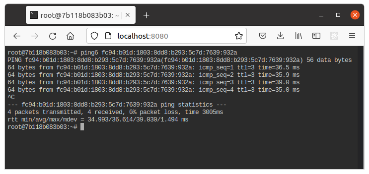

# web-terminal-husarnet-demo
Using https://github.com/tsl0922/ttyd with Husarnet VPN

## Quick start

1. Rename `.env.template` to `.env` and paste your Husarnet Join Code here (find it on https://husarnet.com)

2. Launch with Docker Compose v2:

    ```bash
    docker compose up
    ```

3. Open in your webbrowser: http://localhost:8080/

    Now you can ping other Husarnet hosts by using their Husarnet IPv6 address or just their hostname.

    